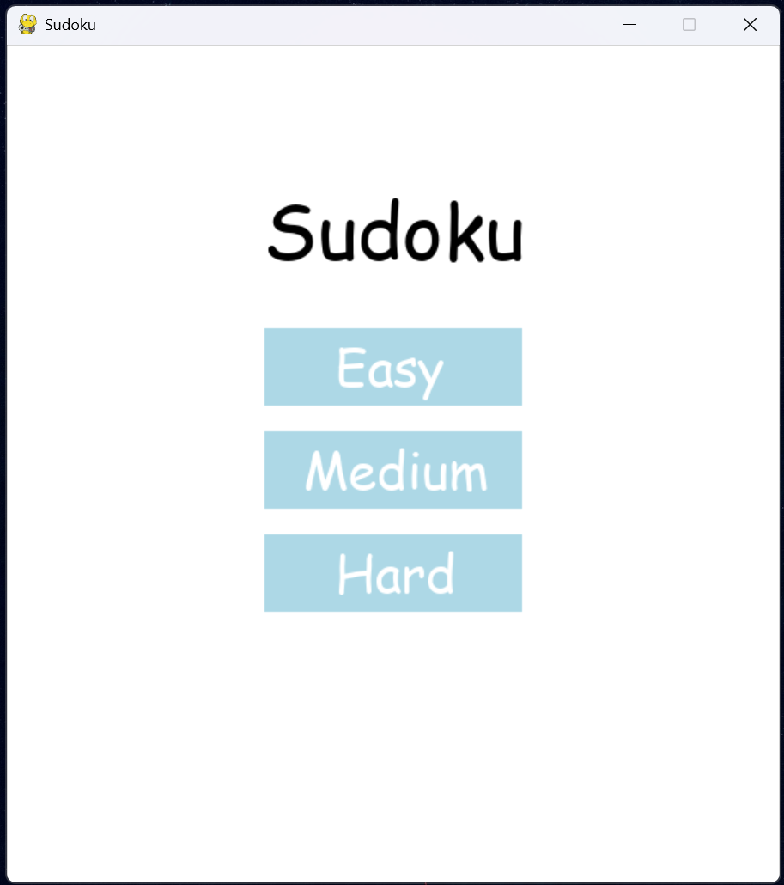
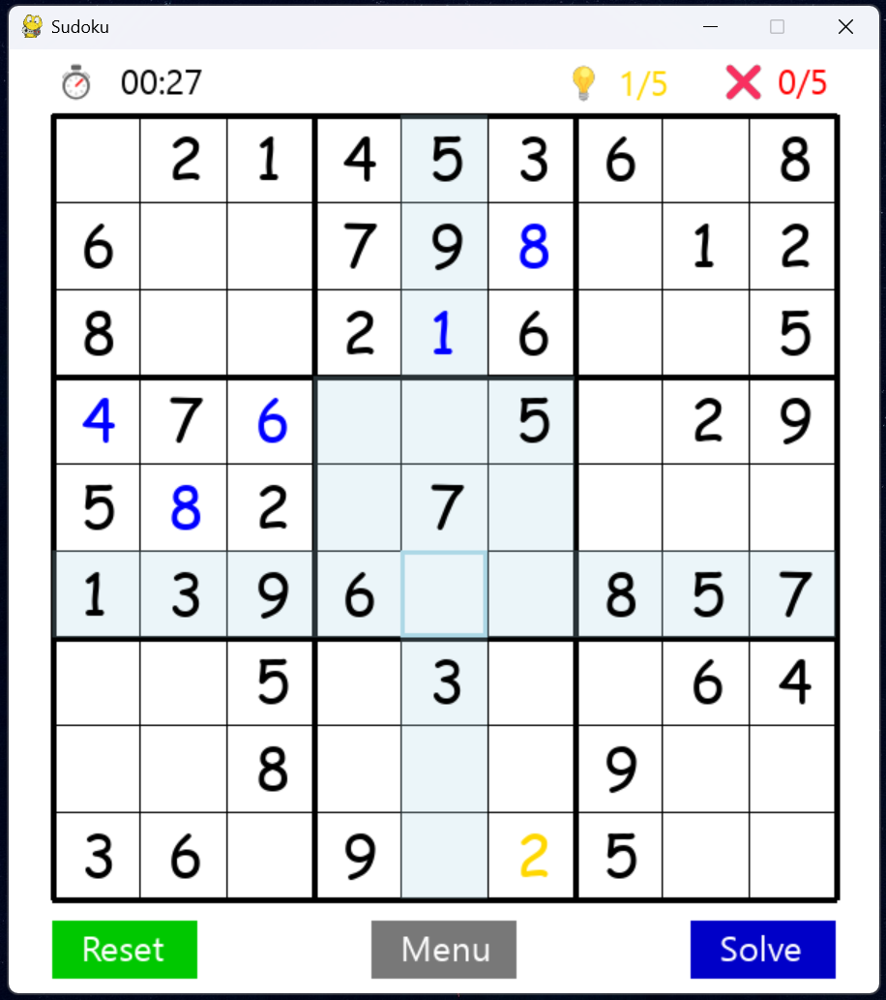
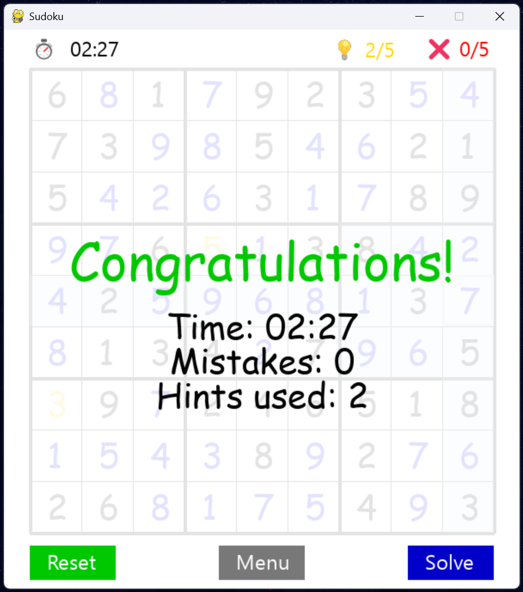
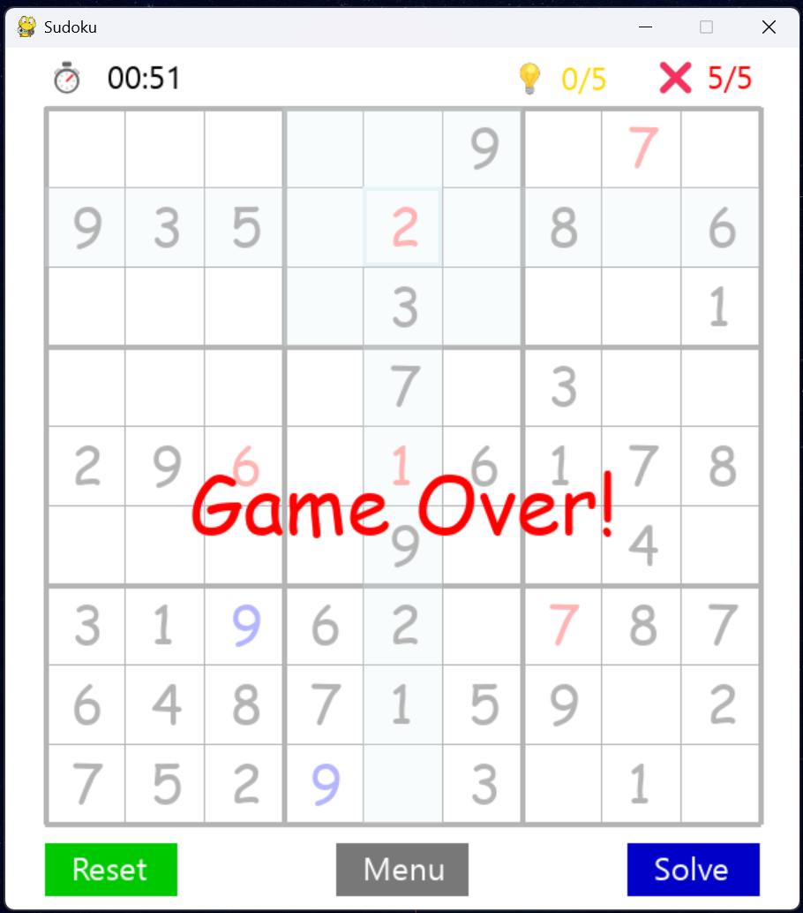

# 🧩 SUDOKU Game

This is a Sudoku puzzle game built with **Python** and **Pygame**. It offers multiple difficulty levels, a built-in backtracking solver, limited hint support, and mistake tracking. A real-time timer monitors your progress as you solve the puzzle on a classic 9×9 Sudoku board.

---
## Screenshots & Features
<div align="center">
<table>
  <tr>
    <td align="center">
      <br/>
      <strong>Main Menu</strong>
    </td>
    <td align="center">
      <br/>
      <strong>Gameplay</strong>
    </td>
  </tr>
  <tr>
    <td align="center">
      <br/>
      <strong>Win Screen</strong>
    </td>
    <td align="center">
      <br/>
      <strong>Game Over</strong>
    </td>
  </tr>
</table>
</div>

**Key Features:**
- **Difficulty Selection**: Choose between **Easy**, **Medium**, or **Hard** puzzles from the main menu.
- **Hint System**: Reveal up to 5 correct numbers during the game.
- **Mistake Tracker**: Game ends after 5 incorrect guesses.
- **Auto Solver**: Solve the entire puzzle instantly using the `Solve` button.
- **Timer**: Tracks how long you take to complete the puzzle.
- **Reset/Menu Options**: Restart the puzzle or return to the main menu at any time.

---

## Prerequisites

Ensure you have **Python 3.x** and **pip** installed. Then, install Pygame:

```
pip install pygame
```

## Usage

### 1. Clone the Repository

```
git clone https://github.com/bhakuni27/Sudoku.git
cd Sudoku
```
### 2. Run the Game

```
python Sudoku.py
```
## How to Play

- Select a **difficulty level**: Easy, Medium, or Hard from the main menu.
- **Click** on an empty cell and **type a number (1–9)** to fill it in.
- Use **Backspace** to delete a number you've entered.
- Click the **💡 Hint** button to reveal a correct number (limited to 5 hints per game).
- You have a maximum of **5 mistakes** before the game ends.
- Click **Solve** to automatically fill in the solution.
- Use **Reset** to start over or **Menu** to return to the main screen.


